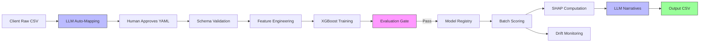
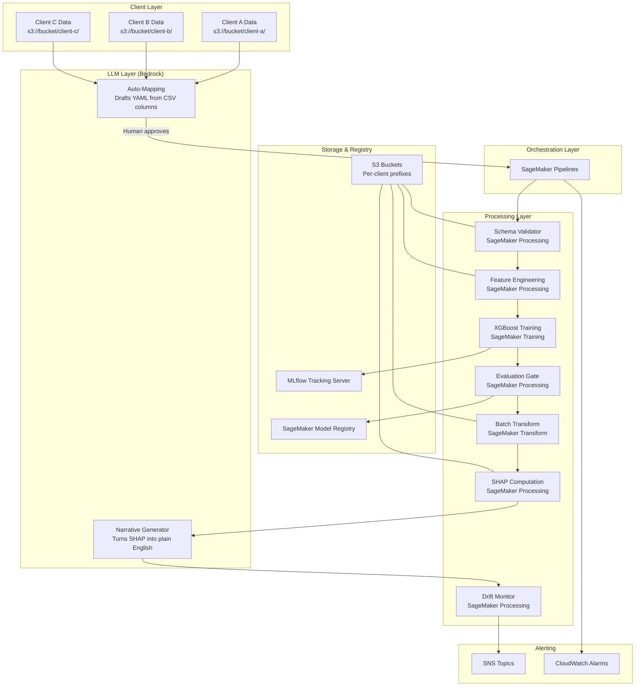

# Design Document: Productized Churn Prediction Pipeline

## Overview

This design specifies a standalone, productized churn prediction pipeline on AWS. The system takes two inputs — a raw CSV data file and a YAML mapping configuration — and produces a scored customer list with churn probabilities, risk tiers, SHAP explanations, and LLM-generated narratives.

The pipeline uses:
- **Amazon Bedrock (Claude)** for two LLM-powered steps: auto-mapping during client onboarding and narrative explanation generation after scoring
- **XGBoost (SageMaker built-in)** for training — a "team of decision trees" algorithm where each tree learns from the mistakes of the previous ones, requiring no custom Docker containers
- **SageMaker Batch Transform** for scoring — compute that spins up only when needed, like hiring a temp worker for one day
- **SageMaker Pipelines** for orchestration — the factory floor manager that controls step ordering and error handling
- **SHAP** for explainability — computes how much each feature pushed each prediction up or down
- **PSI-based drift detection** for monitoring — a smoke detector that alerts when the data world changes
- **MLflow** for experiment tracking — the lab notebook recording every setting and result



## Architecture

### High-Level Architecture



### How Each Piece Works (Feynman-Style)

**XGBoost Training — "A Team That Learns From Mistakes"**

Imagine 100 people each guessing whether a customer will leave. The first person makes crude guesses. The second person sees what the first got wrong and focuses on those. The third corrects what the first two missed together. After 100 rounds of this, the team's combined verdict is remarkably accurate — even though each individual is only slightly better than random. That's gradient boosting. "XG" just means "extreme" (it's fast). SageMaker provides this as a pre-built tool — we configure settings and feed data, AWS handles the computation.

**Batch Transform — "Hire a Temp, Not a Full-Timer"**

Some systems keep a prediction server running 24/7 (costs ~$50-200/month). We don't need real-time predictions — clients want a weekly report. Batch Transform spins up a machine, scores all customers in one pass, then shuts down. We pay for minutes of compute, not months. For a 7,000-customer dataset, this takes about 3-5 minutes and costs pennies.

**SHAP — "Show Your Work"**

When the model says "Customer X: 85% chance of leaving," SHAP asks: "How much did each piece of information contribute?" It's like asking a jury to explain their verdict: "month-to-month contract added +23% risk, being a customer for only 2 months added +15% risk, but having a partner reduced risk by -8%." Every feature gets a signed contribution score. The top 3 (by absolute value) become the customer's "reasons."

**PSI Drift Detection — "Is the World the Same?"**

When we trained the model, customers looked a certain way — maybe average tenure was 24 months. If next month's batch has average tenure of 6 months, the model is seeing a world it wasn't trained for. PSI quantifies this: divide each feature into 10 buckets based on training data, count what percentage of customers fall in each bucket now vs. then, and compute a divergence score. Below 0.1 = safe. Above 0.2 = the world changed, model may be unreliable.

**Amazon Bedrock (Claude) — "Natural Language Understanding on Demand"**

Bedrock lets us call Claude via API — send text in, get text back, pay per token (fraction of a cent per call). We use it for two things that require natural language understanding: (1) recognizing that a column called "amt_per_month" probably maps to "monthly_charges", and (2) turning SHAP numbers into English paragraphs. Both are non-blocking: if Bedrock fails, the pipeline continues without these features.

### AWS Services Used

| Service | Purpose | How It Works |
|---------|---------|------|
| SageMaker Pipelines | Orchestrates the end-to-end workflow | Defines step ordering, handles failures, supports conditional logic |
| SageMaker Processing | Runs validation, feature engineering, evaluation, SHAP, monitoring | General-purpose compute jobs that run a Python script |
| SageMaker Training | Trains XGBoost with hyperparameter tuning | Spins up GPU/CPU instances, runs training algorithm, saves model artifact |
| SageMaker Batch Transform | Scores customer data in bulk | Loads a trained model, feeds data through it, writes predictions to S3 |
| SageMaker Model Registry | Version-controls trained models | Stores model artifacts with metadata, supports approval workflow |
| Amazon Bedrock | LLM calls for auto-mapping and narrative generation | Managed API for Claude — no infrastructure to maintain |
| S3 | Stores all data, artifacts, configs, outputs | Object storage with per-client prefix isolation |
| MLflow (on EC2/ECS) | Tracks experiments, metrics, parameters | Records what was tried, what worked, enables comparison |
| SNS | Sends alert notifications | Publishes messages to subscribers (email, Slack, etc.) |
| CloudWatch | Logs and metrics for pipeline execution | Stores logs, enables alarm-based monitoring |
| IAM | Access control and data isolation | Restricts which pipeline execution can access which S3 prefix |

## Components and Interfaces

### Component 1: LLM Auto-Mapping Module

**What it does:** When a new client uploads a CSV, this module reads the column names and a few sample rows, then asks Claude (via Bedrock) to guess which standard field each column maps to. It produces a draft YAML that a human reviews before the pipeline uses it.

**Why an LLM?** Column mapping is fundamentally a natural language problem. A human instantly recognizes that "MonthlyCharges", "mrr", "monthly_fee", and "amt_per_month" all mean the same thing. LLMs are trained on exactly this kind of pattern recognition. Rule-based approaches would require maintaining an ever-growing dictionary of synonyms.

```python
# auto_mapping.py

from dataclasses import dataclass
from typing import Dict, List, Optional
import json
import boto3

@dataclass
class ColumnMapping:
    source_column: str       # Original column name in client CSV
    target_field: str        # Standard field name from Data Contract
    confidence: str          # "high", "medium", "low"
    reasoning: str           # Why the LLM thinks this mapping is correct

@dataclass
class AutoMappingResult:
    client_id: str
    source_columns: List[str]
    sample_rows: List[Dict]
    mappings: List[ColumnMapping]
    unmapped_columns: List[str]   # Columns the LLM couldn't map
    draft_yaml_path: str          # Where the .draft.yaml was written

def read_csv_metadata(s3_path: str, sample_size: int = 5) -> tuple:
    """Read column names and up to sample_size rows from a CSV in S3."""
    ...

def build_mapping_prompt(
    columns: List[str],
    sample_rows: List[Dict],
    standard_fields: Dict
) -> str:
    """
    Construct the prompt for Claude that includes:
    - The list of standard fields with descriptions
    - The client's column names
    - Sample data rows for context
    - Instructions to output a structured mapping with confidence scores
    """
    ...

def call_bedrock_for_mapping(prompt: str) -> Optional[List[ColumnMapping]]:
    """
    Call Amazon Bedrock (Claude) with the mapping prompt.
    Returns parsed mappings or None if the call fails.
    Non-blocking: failures are logged and the function returns None.
    """
    ...

def write_draft_yaml(mappings: List[ColumnMapping], client_id: str, output_path: str) -> str:
    """
    Write the LLM's mapping suggestions as a .draft.yaml file.
    Includes confidence scores as comments for human review.
    Returns the path where the draft was written.
    """
    ...

def is_mapping_approved(client_config_path: str) -> bool:
    """
    Check if a mapping.yaml (not .draft.yaml) exists.
    The pipeline only proceeds if the human has approved by renaming the file.
    """
    ...
```

### Component 2: Data Contract & Validator

**What it does:** Defines the "shape" of data the pipeline accepts (a universal form with required and optional fields), then checks whether incoming data fills in that form correctly.

The data contract has three tiers:
- **Tier 1 (Required):** Without these, the pipeline can't function — customer_id, tenure_months, monthly_charges, total_charges, churn_label
- **Tier 2 (Engagement):** Makes the model better but isn't essential — contract_type, payment_method, support_tickets
- **Tier 3 (Demographics):** Nice to have — gender, age_bucket, partner_status

```python
# data_contract.py

from dataclasses import dataclass
from enum import Enum
from typing import Dict, List, Optional

class Tier(Enum):
    REQUIRED = 1
    ENGAGEMENT = 2
    DEMOGRAPHIC = 3

@dataclass
class FieldSpec:
    name: str
    dtype: str           # "float", "int", "category", "string"
    tier: Tier
    description: str
    allowed_values: Optional[List[str]] = None

STANDARD_SCHEMA: Dict[str, FieldSpec] = {
    "customer_id": FieldSpec("customer_id", "string", Tier.REQUIRED, "Unique customer identifier"),
    "tenure_months": FieldSpec("tenure_months", "int", Tier.REQUIRED, "Months as active customer"),
    "monthly_charges": FieldSpec("monthly_charges", "float", Tier.REQUIRED, "Monthly billing amount"),
    "total_charges": FieldSpec("total_charges", "float", Tier.REQUIRED, "Cumulative billing amount"),
    "churn_label": FieldSpec("churn_label", "int", Tier.REQUIRED, "1=churned, 0=retained"),
    "contract_type": FieldSpec("contract_type", "category", Tier.ENGAGEMENT,
                               "Contract duration", ["month-to-month", "one_year", "two_year"]),
    "payment_method": FieldSpec("payment_method", "category", Tier.ENGAGEMENT, "How they pay"),
    "support_tickets": FieldSpec("support_tickets", "int", Tier.ENGAGEMENT, "Number of support contacts"),
    "gender": FieldSpec("gender", "category", Tier.DEMOGRAPHIC, "Customer gender"),
    "age_bucket": FieldSpec("age_bucket", "category", Tier.DEMOGRAPHIC, "Age range bucket"),
    "partner_status": FieldSpec("partner_status", "category", Tier.DEMOGRAPHIC, "Has partner yes/no"),
}
```

```python
# validator.py

@dataclass
class ValidationResult:
    is_valid: bool
    tier1_present: List[str]
    tier1_missing: List[str]
    tier2_present: List[str]
    tier2_missing: List[str]
    tier3_present: List[str]
    tier3_missing: List[str]
    errors: List[str]

def validate_dataset(df: pd.DataFrame, schema: Dict[str, FieldSpec]) -> ValidationResult:
    """
    Check incoming data against the data contract.
    Rule: if ANY Tier 1 field is missing → is_valid = False.
    Tier 2/3 missing is fine — just logged.
    """
    ...

def apply_mapping_config(df: pd.DataFrame, config: MappingConfig) -> pd.DataFrame:
    """
    Apply a client's YAML mapping to rename columns, coerce types, and map values.
    This happens BEFORE validation — translating client-speak into standard-speak.
    """
    ...
```

### Component 3: Mapping Config (Per-Client)

**What it does:** A YAML file that serves as a translation dictionary between a client's column names and the pipeline's standard names. Also handles value conversions (like "Yes" → 1) and type conversions (like string → number).

```yaml
# Example: configs/client_telco/mapping.yaml
client_id: "telco_ibm"
source_description: "IBM Telco Customer Churn dataset"

column_mappings:
  customerID: customer_id
  tenure: tenure_months
  MonthlyCharges: monthly_charges
  TotalCharges: total_charges
  Churn: churn_label
  Contract: contract_type
  PaymentMethod: payment_method
  gender: gender
  Partner: partner_status

value_mappings:
  churn_label:
    "Yes": 1
    "No": 0
  contract_type:
    "Month-to-month": "month-to-month"
    "One year": "one_year"
    "Two year": "two_year"
  partner_status:
    "Yes": 1
    "No": 0

type_coercions:
  total_charges: "float"
  tenure_months: "int"
```

```python
# mapping_config.py

@dataclass
class MappingConfig:
    client_id: str
    source_description: str
    column_mappings: Dict[str, str]       # raw_name -> standard_name
    value_mappings: Dict[str, Dict]       # field -> {raw_value: standard_value}
    type_coercions: Dict[str, str]        # field -> target_type

def load_mapping_config(yaml_path: str) -> MappingConfig:
    """Parse a YAML mapping file into a MappingConfig object."""
    ...

def serialize_mapping_config(config: MappingConfig) -> str:
    """Serialize a MappingConfig object back to YAML string."""
    ...

def apply_mapping(df: pd.DataFrame, config: MappingConfig) -> pd.DataFrame:
    """
    Apply the full mapping pipeline:
    1. Rename columns (column_mappings)
    2. Convert values (value_mappings)
    3. Coerce types (type_coercions)
    """
    ...
```

### Component 4: Feature Engineering

**What it does:** Takes validated data (with correct column names and types) and transforms it into a grid of numbers the model can learn from.

Why is this needed? A model can't understand "contract = month-to-month" — it only understands numbers. Feature engineering performs three transformations:
1. **Encoding:** Convert categories to numbers (month-to-month → 0, one_year → 1, two_year → 2)
2. **Scaling:** Make all numbers comparable. If "tenure" ranges 1-72 and "monthly_charges" ranges 18-118, the model might think charges matter more just because the numbers are bigger. Scaling puts everything on the same scale.
3. **Interaction features:** Create combinations like monthly_charges × tenure_months. This captures "total lifetime value" which neither feature alone conveys.

```python
# feature_engineering.py

@dataclass
class FeatureArtifacts:
    """
    Stores all the 'recipes' learned during training so we can
    apply the exact same transformations during scoring.
    """
    scaler: StandardScaler        # How to scale numbers
    encoders: Dict[str, LabelEncoder]  # How to encode categories
    impute_values: Dict[str, float]    # What to fill blanks with
    feature_names: List[str]           # Column order

def engineer_features(
    df: pd.DataFrame,
    fit: bool = True,
    artifacts: Optional[FeatureArtifacts] = None
) -> Tuple[np.ndarray, FeatureArtifacts]:
    """
    Transform validated dataframe into model-ready feature matrix.

    fit=True (training mode): Learn the transformation rules from this data.
    fit=False (scoring mode): Apply previously-learned rules. Critical because
    scoring data MUST be transformed the exact same way as training data —
    otherwise the model sees a different 'language' than it learned.
    """
    ...
```

### Component 5: Model Training

**What it does:** Feeds prepared data to XGBoost, which builds a team of decision trees that collectively learn to predict churn. The system automatically tries many combinations of settings (hyperparameters) and picks the best one.

**Key hyperparameters explained:**
- **max_depth (3-10):** How many yes/no questions each tree can ask. Deeper = more complex patterns captured, but too deep = the model memorizes specific customers instead of learning general patterns (overfitting).
- **eta / learning_rate (0.01-0.3):** How much each new tree corrects the previous ones. Low = cautious learning (needs more trees but generalizes better). High = aggressive learning (fewer trees but may overreact to noise).
- **subsample (0.5-1.0):** What fraction of customers each tree sees. Using less (e.g., 70%) prevents memorization — each tree gets a slightly different view of the data.
- **colsample_bytree (0.5-1.0):** What fraction of features each tree considers. Prevents any single feature from dominating every tree.
- **min_child_weight (1-10):** How many customers a tree needs to see before making a rule. Higher = more conservative (won't make rules based on 1-2 customers).
- **scale_pos_weight:** When few customers churn (e.g., 15%), the model can get lazy and predict "won't churn" for everyone — it'd be right 85% of the time! This multiplier says "pay 5.67x more attention to churners" (computed as: count_non_churners / count_churners).

```python
# training.py

from sagemaker.tuner import IntegerParameter, ContinuousParameter

HYPERPARAMETER_RANGES = {
    "max_depth": IntegerParameter(3, 10),
    "eta": ContinuousParameter(0.01, 0.3),
    "subsample": ContinuousParameter(0.5, 1.0),
    "colsample_bytree": ContinuousParameter(0.5, 1.0),
    "min_child_weight": IntegerParameter(1, 10),
    "scale_pos_weight": None,  # Computed from actual class imbalance ratio
}

def compute_scale_pos_weight(labels: np.ndarray) -> float:
    """
    Compute how much extra attention the model should pay to churners.
    Formula: count(non-churners) / count(churners)
    Example: 5950 stayed / 1050 left = 5.67 → "each churner counts as 5.67 customers"
    """
    n_positive = labels.sum()
    n_negative = len(labels) - n_positive
    return n_negative / n_positive

def create_stratified_splits(
    features: np.ndarray,
    labels: np.ndarray,
    train_ratio: float = 0.70,
    val_ratio: float = 0.15,
    test_ratio: float = 0.15
) -> tuple:
    """
    Split data into train/validation/test sets while preserving the
    proportion of churners in each split. If 20% churned overall,
    each split should have ~20% churners.
    """
    ...

def launch_training_job(
    train_data_s3: str,
    validation_data_s3: str,
    client_id: str,
    mlflow_tracking_uri: str
) -> str:
    """Launch SageMaker HyperparameterTuner job for XGBoost."""
    ...
```

### Component 6: Evaluation Gate

**What it does:** Tests the trained model on data it has never seen and decides: is this model good enough to use?

The key metric is AUC-ROC. Imagine sorting all customers by how likely the model thinks they'll leave. A perfect model puts all actual leavers at the top of the list. AUC measures how close to perfect the model's sorting is:
- **1.0** = perfect (all leavers at the top)
- **0.5** = random (useless — same as flipping a coin)
- **0.70 (our minimum)** = the model puts actual leavers meaningfully higher in the list than non-leavers

We also track F1 score, which balances two competing mistakes: wrongly flagging loyal customers (false positives) vs. missing actual leavers (false negatives). F1 is the harmonic mean of precision ("of everyone I flagged, how many actually left?") and recall ("of everyone who left, how many did I flag?").

```python
# evaluation.py

@dataclass
class EvaluationResult:
    passed: bool          # Did the model pass the quality gate?
    auc_roc: float        # How well does the model sort customers? (0.5-1.0)
    f1_score: float       # Balance between precision and recall (0.0-1.0)
    precision: float      # Of flagged customers, what fraction actually left?
    recall: float         # Of actual leavers, what fraction did we catch?
    threshold: float      # The minimum AUC required (0.70)

def evaluate_model(
    y_true: np.ndarray,
    y_pred_proba: np.ndarray,
    min_auc_threshold: float = 0.70
) -> EvaluationResult:
    """
    Evaluate model on held-out test set.
    Pass/fail depends SOLELY on AUC-ROC >= threshold.
    Other metrics are logged for information but don't affect the gate.
    """
    ...

def generate_model_card(
    eval_result: EvaluationResult,
    training_params: Dict,
    dataset_info: Dict,
    feature_list: List[str]
) -> Dict:
    """
    Generate a 'nutrition label' for the model — all the metadata
    someone needs to understand what this model is, how it was trained,
    and how well it performs.
    """
    ...
```

### Component 7: Batch Scoring + SHAP Explanations

**What it does:** Takes the approved model and runs it on all current customers to produce churn predictions. Then SHAP explains WHY each prediction was made by computing how much each feature pushed the probability up or down.

**Risk tiers** convert raw probabilities into action categories:
- **High (≥ 0.7):** "This customer is very likely leaving — intervene NOW"
- **Medium (0.4 to 0.7):** "This customer is at risk — monitor closely"
- **Low (< 0.4):** "This customer seems safe — no immediate action needed"

**SHAP explanations** work like a courtroom verdict. Instead of just saying "guilty" (will churn), SHAP explains: "month-to-month contract contributed +23% risk, low tenure contributed +15%, but having a partner reduced risk by -8%." Each feature gets a signed contribution score. We take the top 3 by absolute value as the "reasons."

```python
# scoring.py

RISK_THRESHOLDS = {
    "high": 0.7,
    "medium": 0.4,
    "low": 0.0
}

def assign_risk_tier(probability: float) -> str:
    """
    Convert a raw probability into a human-friendly risk label.
    Deterministic: same probability always gets same tier.
    """
    if probability >= 0.7:
        return "high"
    elif probability >= 0.4:
        return "medium"
    else:
        return "low"

def extract_top_reasons(
    shap_values: np.ndarray,
    feature_names: List[str],
    top_n: int = 3
) -> List[str]:
    """
    Given SHAP contributions for one customer, extract the top N features
    that most influenced the prediction (by absolute value).
    Format: "feature_name=value (+/-contribution)"
    """
    ...

def run_batch_scoring(
    model_name: str,
    input_data_s3: str,
    output_s3_prefix: str,
    client_id: str
) -> str:
    """
    Launch SageMaker Batch Transform:
    1. Spin up compute instance
    2. Load the trained model
    3. Feed all customer data through it
    4. Write predictions to S3
    5. Shut down compute (we stop paying)
    """
    ...

def compute_shap_explanations(
    model_artifact_s3: str,
    scored_data: pd.DataFrame,
    feature_names: List[str]
) -> pd.DataFrame:
    """
    For each customer, compute how much each feature pushed their
    churn probability up or down. Returns a DataFrame of SHAP values
    with the same shape as the input features.
    """
    ...
```

### Component 8: LLM Narrative Generator

**What it does:** Takes the raw SHAP numbers (like "contract_type=month-to-month (+0.23)") and asks Claude to write a plain-English paragraph explaining what those numbers mean for a non-technical reader.

**Why an LLM?** SHAP gives us "contract_type=month-to-month (+0.23)" — useful for a data scientist, but meaningless to a business user. A human would read that and write: "This customer has no long-term commitment. Month-to-month customers are 3x more likely to leave than those on annual contracts." The LLM does this translation at scale, for dozens of customers in seconds.

**Cost:** We batch customers (default: 50 per prompt) into a single Bedrock call. At ~$0.003 per 1K input tokens, processing 50 customers costs roughly $0.01-0.02 per batch. The whole step costs cents, not dollars.

```python
# narrative_generator.py

@dataclass
class NarrativeRequest:
    customer_id: str
    churn_probability: float
    risk_tier: str
    top_shap_features: List[Dict]  # [{feature, value, contribution}]

@dataclass
class NarrativeResult:
    customer_id: str
    narrative: str       # Plain-English explanation (under 150 words)
    success: bool        # Whether the LLM call succeeded

SYSTEM_PROMPT = """You are an expert customer retention analyst writing for non-technical 
business users. For each customer, explain in plain English WHY the model predicts they 
are at risk of leaving. Reference specific feature values. Use simple language. 
Keep each explanation under 150 words. Do not use technical jargon like 'SHAP values' 
or 'feature importance.'"""

def build_narrative_prompt(
    batch: List[NarrativeRequest],
    feature_definitions: Dict[str, str]
) -> str:
    """
    Construct a prompt containing multiple customers for batch processing.
    Includes feature definitions so the LLM understands what each feature means.
    """
    ...

def call_bedrock_for_narratives(prompt: str) -> Optional[Dict[str, str]]:
    """
    Call Amazon Bedrock (Claude) to generate narratives.
    Returns {customer_id: narrative_text} or None on failure.
    Non-blocking: if Bedrock fails, returns None.
    """
    ...

def parse_narrative_response(
    response_text: str,
    expected_customer_ids: List[str]
) -> Dict[str, str]:
    """
    Parse the LLM's response into individual customer narratives.
    Validates that each expected customer_id has a corresponding narrative.
    """
    ...

def generate_narratives_for_batch(
    scored_customers: List[NarrativeRequest],
    batch_size: int = 50
) -> Dict[str, NarrativeResult]:
    """
    Process all high-risk customers in batches.
    If a batch fails, mark those customers as success=False with N/A narrative.
    Pipeline continues regardless.
    """
    ...
```

### Component 9: Drift Monitoring

**What it does:** After scoring, checks whether today's customer data looks like the data the model was trained on. If it looks different (the "world changed"), the model might be making predictions based on patterns that no longer exist.

**How PSI works (step by step):**
1. During training, we recorded how customers were distributed across each feature. For example, 30% had tenure 0-12 months, 40% had 12-36 months, 30% had 36+ months.
2. When new scoring data comes in, we count the same buckets. Maybe now 60% have tenure 0-12 months.
3. PSI measures the divergence: PSI = Σ (new_% - old_%) × ln(new_% / old_%)
4. Interpretation: PSI < 0.1 = stable. PSI 0.1-0.2 = something shifted. PSI > 0.2 = significant change, model may be unreliable.

A special case: if you compute PSI of a distribution against itself, the answer is always 0.0 (no difference). This is how we verify our PSI implementation is correct.

```python
# monitoring.py

@dataclass
class DriftReport:
    run_date: str
    features_checked: int
    features_drifted: List[str]       # Names of features with PSI > threshold
    psi_scores: Dict[str, float]      # feature_name -> PSI value
    alert_triggered: bool             # True if any feature exceeded threshold

def compute_psi(
    reference: np.ndarray,
    current: np.ndarray,
    bins: int = 10
) -> float:
    """
    Compute Population Stability Index between two distributions.

    How it works:
    1. Divide the reference data into N equal-width buckets
    2. Count what % of reference falls in each bucket
    3. Count what % of current falls in each bucket
    4. For each bucket: (current_% - reference_%) * ln(current_% / reference_%)
    5. Sum across all buckets

    Result interpretation:
    - 0.0: identical distributions (comparing something to itself)
    - < 0.1: negligible drift (safe)
    - 0.1-0.2: moderate drift (watch)
    - > 0.2: significant drift (alert, consider retraining)
    """
    ...

def check_drift(
    training_stats: Dict,
    current_data: pd.DataFrame,
    threshold: float = 0.2
) -> DriftReport:
    """
    Compare current scoring batch against training distribution.
    Computes PSI per feature and flags any that exceed the threshold.
    """
    ...
```

### Component 10: Pipeline Orchestration

**What it does:** Connects all components into a single automated workflow using SageMaker Pipelines. Defines the order of steps, what data flows between them, and what happens when something fails.

```python
# pipeline.py
from sagemaker.workflow.pipeline import Pipeline
from sagemaker.workflow.steps import ProcessingStep, TuningStep, TransformStep
from sagemaker.workflow.conditions import ConditionGreaterThanOrEqualTo
from sagemaker.workflow.condition_step import ConditionStep

def create_churn_pipeline(
    client_id: str,
    role: str,
    bucket: str,
    pipeline_name: str = "churn-prediction-pipeline"
) -> Pipeline:
    """
    Create a SageMaker Pipeline with steps:
    1. validate_data (ProcessingStep) — check data meets contract
    2. feature_engineering (ProcessingStep) — transform data into numbers
    3. train_model (TuningStep) — train XGBoost with hyperparameter search
    4. evaluate_model (ProcessingStep) — is the model good enough?
    5. register_model (conditional on eval pass) — save to registry
    6. batch_score (TransformStep) — predict churn for all customers
    7. compute_shap (ProcessingStep) — explain predictions
    8. generate_narratives (ProcessingStep) — LLM writes plain English
    9. monitor_drift (ProcessingStep) — check if data world changed

    Each step failure triggers SNS alert and halts execution.
    """
    ...
```

### Component 11: S3 Path Manager

**What it does:** Generates and validates all S3 paths for a given client, ensuring strict data isolation — Client A's pipeline can never accidentally read or write Client B's data.

```python
# s3_paths.py

class S3PathManager:
    """
    Generates all S3 paths for a client, ensuring every path
    contains the client_id prefix. Also validates that a given
    path belongs to the correct client (data isolation check).
    """

    def __init__(self, bucket: str, client_id: str):
        self.bucket = bucket
        self.client_id = client_id
        self.base_prefix = f"s3://{bucket}/{client_id}"

    def raw_data_path(self, upload_date: str) -> str: ...
    def config_path(self) -> str: ...
    def processed_path(self, run_date: str) -> str: ...
    def model_path(self, model_version: str) -> str: ...
    def output_path(self, run_date: str) -> str: ...
    def monitoring_path(self, run_date: str) -> str: ...

    def validate_path_belongs_to_client(self, path: str) -> bool:
        """
        Security check: does this path belong to our client?
        Returns True only if the path contains our client_id prefix.
        """
        ...
```

## Data Models

### S3 Bucket Structure

```
s3://churn-pipeline-{account_id}/
├── {client_id}/
│   ├── raw/                          # Client uploads raw CSV here
│   │   └── {upload_date}/data.csv
│   ├── configs/
│   │   ├── mapping.yaml              # Human-approved mapping (pipeline uses this)
│   │   └── mapping.draft.yaml        # LLM-generated draft (awaiting approval)
│   ├── processed/                    # After validation + feature engineering
│   │   └── {run_date}/
│   │       ├── features.csv
│   │       └── labels.csv
│   ├── models/
│   │   └── {model_version}/
│   │       ├── model.tar.gz          # Trained XGBoost model artifact
│   │       ├── model_card.json       # Model metadata and metrics
│   │       └── feature_artifacts.pkl # Fitted encoders/scalers for scoring
│   ├── outputs/
│   │   └── scores/
│   │       └── {run_date}/
│   │           └── predictions.csv   # THE CLIENT DELIVERABLE
│   └── monitoring/
│       ├── training_stats.json       # Reference distributions for PSI
│       └── drift_reports/
│           └── {run_date}/report.json
└── shared/
    ├── data_contract.json            # Standard schema definition
    └── pipeline_config.json          # Default pipeline parameters
```

### Output CSV Schema (The Client Deliverable)

This is what the client actually receives — a spreadsheet telling them who's at risk and why:

```csv
customer_id,churn_probability,risk_tier,top_3_reasons,narrative_explanation
CUST_001,0.87,high,"contract_type=month-to-month (+0.23); support_tickets=5 (+0.18); tenure_months=2 (+0.15)","This customer has no long-term commitment and has contacted support 5 times in just 2 months. Month-to-month customers with high support volume are among the most likely to leave. Consider offering a discounted annual plan."
CUST_002,0.34,low,"contract_type=two_year (-0.31); tenure_months=48 (-0.22); total_charges=high (-0.12)","N/A - low risk customer"
```

### Model Card Schema

A "nutrition label" for the model — everything someone needs to know about how it was built and how well it works:

```json
{
    "model_id": "churn-xgb-v3",
    "training_date": "2024-01-15",
    "client_id": "telco_ibm",
    "dataset_rows": 7043,
    "feature_count": 12,
    "features_used": ["tenure_months", "monthly_charges", "total_charges", "..."],
    "metrics": {
        "auc_roc": 0.82,
        "f1_score": 0.74,
        "precision": 0.78,
        "recall": 0.71
    },
    "hyperparameters": {
        "max_depth": 6,
        "eta": 0.1,
        "subsample": 0.8,
        "colsample_bytree": 0.8,
        "min_child_weight": 3,
        "scale_pos_weight": 2.76
    },
    "evaluation_gate": {
        "passed": true,
        "threshold": 0.70,
        "margin": 0.12
    },
    "data_contract_version": "1.0",
    "training_data_hash": "sha256:abc123..."
}
```

### Mapping Config Schema (YAML)

```yaml
client_id: string          # Unique client identifier
source_description: string # Human description of data source

column_mappings:           # raw_column_name -> standard_field_name
  <raw_name>: <standard_name>

value_mappings:            # Field-level value transformations
  <standard_name>:
    <raw_value>: <standard_value>

type_coercions:            # Fields needing type conversion
  <standard_name>: <target_type>
```

### Draft Mapping Config (LLM-Generated)

The auto-mapping module produces this extended format with confidence annotations:

```yaml
client_id: "new_client"
source_description: "Auto-generated by LLM from CSV analysis"
generated_at: "2024-01-15T10:30:00Z"
status: "draft"  # Must be changed to "approved" by human

column_mappings:
  MonthlyCharges: monthly_charges    # confidence: high
  CustID: customer_id                # confidence: high
  months_active: tenure_months       # confidence: medium
  amt_total: total_charges           # confidence: medium
  left_service: churn_label          # confidence: low

confidence_scores:
  MonthlyCharges: "high"
  CustID: "high"
  months_active: "medium"
  amt_total: "medium"
  left_service: "low"

value_mappings:
  churn_label:
    "yes": 1
    "no": 0

type_coercions:
  total_charges: "float"
```

## Correctness Properties

*A property is a characteristic or behavior that should hold true across all valid executions of a system — essentially, a formal statement about what the system should do. Properties serve as the bridge between human-readable specifications and machine-verifiable correctness guarantees.*

### Property 1: Mapping Config Round-Trip Consistency

*For any* valid mapping configuration (with arbitrary client_id, column_mappings, value_mappings, and type_coercions), serializing it to YAML and then parsing it back SHALL produce a structurally equivalent MappingConfig object.

This is a "round-trip" property — like translating English to Spanish and back. If the translation is correct, you get back what you started with. If serialization or parsing has bugs, the round-trip breaks.

**Validates: Requirements 2.5, 2.6**

### Property 2: Schema Validation Completeness

*For any* dataset that contains all Tier 1 fields (customer_id, tenure_months, monthly_charges, total_charges, churn_label) with valid types, the validator SHALL report is_valid=True regardless of which Tier 2 or Tier 3 fields are present or absent. Conversely, *for any* dataset missing at least one Tier 1 field, the validator SHALL report is_valid=False.

This property ensures the validator's decision is determined entirely by Tier 1 completeness — optional fields never cause rejection.

**Validates: Requirements 2.2, 2.3, 2.4**

### Property 3: Feature Matrix Integrity

*For any* schema-conformant input dataframe with N rows (possibly containing null values and mixed types), the feature engineering module SHALL produce a feature matrix with exactly N rows, all numeric (float64) columns, and zero null values.

This is a transformation invariant — no matter what valid data goes in, the output always has these three guarantees. If any null leaks through or a row disappears, the model would crash or produce garbage.

**Validates: Requirements 3.1, 3.2, 3.3**

### Property 4: Stratified Split Class Preservation

*For any* binary label array (containing 0s and 1s), the stratified split function SHALL produce train/validation/test sets where the proportion of 1s in each split is within 5 percentage points of the proportion in the original array.

If 20% of customers churned, each split should have approximately 20% churners. Without this guarantee, the model might train on data that looks nothing like reality.

**Validates: Requirements 4.4**

### Property 5: Scale_Pos_Weight Computation Correctness

*For any* binary label array where the minority class (1s) represents less than 30% of the dataset, the computed scale_pos_weight SHALL equal count(0s) / count(1s), and for arrays where the minority class is 30% or more, no weight adjustment SHALL be applied.

This ensures the "pay extra attention to churners" multiplier is always computed correctly from the actual data proportions.

**Validates: Requirements 4.5**

### Property 6: Evaluation Gate Determinism

*For any* set of model metrics (auc_roc, f1_score, precision, recall — all floats in [0, 1]), the evaluation gate pass/fail decision SHALL depend solely on whether auc_roc >= 0.70, independent of all other metric values.

A model with AUC 0.71, F1 0.10, precision 0.05, recall 0.90 must still pass. A model with AUC 0.69, F1 0.99, precision 0.99, recall 0.99 must still fail. Only AUC controls the gate.

**Validates: Requirements 5.1, 5.2**

### Property 7: Risk Tier Assignment Consistency and Monotonicity

*For any* churn probability value p in [0.0, 1.0], the risk tier assignment SHALL be deterministic (same p always gives same tier: p >= 0.7 → "high", 0.4 <= p < 0.7 → "medium", p < 0.4 → "low"). Additionally, *for any* two probabilities p1 > p2, the risk tier of p1 SHALL be greater than or equal to the risk tier of p2.

Monotonicity means a higher probability never gets a LOWER risk tier — which would be nonsensical. This combines two properties into one because monotonicity is a direct consequence of deterministic threshold-based assignment.

**Validates: Requirements 6.3**

### Property 8: SHAP Explanation Completeness

*For any* scored customer with SHAP values across F features (where F >= 3), the top-3 extraction function SHALL return exactly 3 reasons, each referencing a feature name that exists in the model's feature list, sorted by absolute contribution (highest first).

This ensures every customer always gets exactly 3 explanations (not 2, not 4), and those explanations reference real features (not garbage strings).

**Validates: Requirements 6.4**

### Property 9: Client Data Isolation

*For any* client_id string, all S3 paths generated by the S3PathManager for that client SHALL contain the client_id as a path component. Furthermore, *for any* path and any different client_id, the path validation function SHALL return False (rejecting cross-client access).

This is the security backbone — if this property holds, data can never leak between clients.

**Validates: Requirements 10.1, 10.3, 10.4**

### Property 10: PSI Symmetry Baseline

*For any* numerical distribution (array of floats), computing PSI of that distribution against itself SHALL produce a value of 0.0 (within floating-point epsilon of 1e-10).

If something hasn't changed, the "change detector" must report zero change. This is the sanity check for our PSI implementation — any non-zero result when comparing identical data means the math is wrong.

**Validates: Requirements 8.1**

### Property 11: Feature Engineering Idempotence (Scoring Mode)

*For any* input dataframe and fixed feature artifacts, applying feature engineering in scoring mode (fit=False) twice with the same artifacts SHALL produce bit-for-bit identical output both times.

In scoring mode, the transformation should be a pure function — same input + same artifacts = same output, always. If applying it twice gives different results, something is being re-fitted or randomized when it shouldn't be.

**Validates: Requirements 3.1, 3.5**

### Property 12: Narrative Prompt Completeness

*For any* batch of scored customers (each with customer_id, churn_probability, risk_tier, and SHAP features), the prompt construction function SHALL produce a prompt string that contains every customer's ID, probability, tier, and all SHAP feature names with contribution values.

If the prompt is missing information, the LLM can't write accurate narratives. This ensures we always give Claude everything it needs.

**Validates: Requirements 7.3**

## Error Handling

### Error Categories and Responses

| Error Category | What Happens | What We Do | Why |
|---------------|-------------|------------|-----|
| **LLM Auto-Mapping Failure** | Bedrock timeout, rate limit, or garbled response | Log the failure, skip auto-mapping — operator writes YAML manually | Non-blocking: pipeline works without LLM, just slower onboarding |
| **Data Validation Failure** | Missing Tier 1 field (e.g., no customer_id column) | Reject dataset, log which fields are missing, halt pipeline | Can't predict churn without knowing who the customers are |
| **Type Coercion Failure** | "abc" in a numeric column, unparseable values | Log the bad values, reject dataset if >5% of rows affected | Garbage in = garbage out; better to reject than produce wrong predictions |
| **Training Failure** | SageMaker job crash (OOM, spot interruption) | Retry once with 60s backoff, then alert via SNS | Transient failures are common on spot instances |
| **Evaluation Gate Failure** | AUC < 0.70 (model isn't good enough) | Log all metrics, do NOT register model, alert operator | Never serve bad predictions to clients |
| **Batch Transform Failure** | Compute capacity error, model loading failure | Retry once with 30s backoff, then alert | Transient capacity issues are common |
| **LLM Narrative Failure** | Bedrock timeout or malformed response for narrative batch | Log failure, set narrative_explanation = "N/A", continue | Non-blocking: clients still get SHAP reasons, just not English paragraphs |
| **Drift Alert** | PSI > 0.2 for any feature | Log drift report, send alert, continue scoring (don't halt) | Model may still be useful — alert operator but don't stop predictions |
| **S3 Access Denied** | Attempting to access wrong client's prefix | Halt immediately, log security event, alert | Data isolation breach — stop everything |
| **Retraining Alert** | Actual AUC drops below 0.65 | Send high-priority alert, pipeline continues but flags output | Model is degrading — needs human attention for retraining |

### Retry Strategy

```python
RETRY_CONFIG = {
    "bedrock_api": {"max_retries": 2, "backoff_seconds": 5},
    "training_job": {"max_retries": 1, "backoff_seconds": 60},
    "batch_transform": {"max_retries": 1, "backoff_seconds": 30},
    "s3_operations": {"max_retries": 3, "backoff_seconds": 5},
}
```

### Non-Blocking vs. Blocking Failures

The pipeline distinguishes between failures that should HALT everything vs. failures that should be logged and skipped:

**Blocking (halt pipeline):**
- Missing Tier 1 fields (can't proceed without core data)
- Evaluation gate failure (won't serve bad model)
- S3 access denied (security breach)
- Training job failure after retry

**Non-blocking (log and continue):**
- LLM auto-mapping failure (human can write YAML manually)
- LLM narrative failure (SHAP reasons still available)
- Drift alert (predictions may still be useful)
- Missing Tier 2/3 fields (model works without them, just less accurately)

## Testing Strategy

### Unit Tests (pytest)

**What they test:** Individual functions in isolation with specific, known inputs and expected outputs. Like checking each ingredient before cooking.

- Mapping config parsing (valid YAML, invalid YAML, missing fields, extra fields)
- Schema validation logic (all tier combinations, wrong types, empty dataframe)
- Feature engineering transformations (known input → expected output, null handling)
- Risk tier assignment (boundary values: 0.39, 0.40, 0.69, 0.70, 0.71)
- PSI computation (identical distributions → 0, known shifted distributions → known PSI)
- Model card generation (all required keys present)
- S3 path construction and client isolation checks
- Evaluation gate (AUC exactly 0.70 → pass, AUC 0.699 → fail)
- LLM prompt construction (required fields present in prompt string)
- Narrative response parsing (well-formed response, malformed response, missing customers)
- Auto-mapping draft YAML writing (confidence scores present, correct format)
- Scale_pos_weight computation (known imbalanced arrays → expected weight)

### Property-Based Tests (Hypothesis)

**What they test:** Universal properties that must hold for ALL valid inputs, not just the examples we thought of. Like stress-testing the assembly line with thousands of random configurations. Minimum 100 iterations per property.

- **Property 1:** Mapping config round-trip (generate random configs → serialize → parse → compare)
- **Property 2:** Schema validation completeness (random DataFrames with/without Tier 1 → correct validity)
- **Property 3:** Feature matrix integrity (random valid inputs → all-numeric, no nulls, row count preserved)
- **Property 4:** Stratified split preservation (random label arrays → class proportions preserved per split)
- **Property 5:** Scale_pos_weight correctness (random imbalanced arrays → correct weight formula)
- **Property 6:** Evaluation gate determinism (random metric sets → decision based only on AUC)
- **Property 7:** Risk tier consistency & monotonicity (random floats → deterministic tiers, higher prob ≥ tier)
- **Property 8:** SHAP explanation completeness (random SHAP arrays → exactly 3 valid reasons)
- **Property 9:** Client data isolation (random client IDs → all paths contain correct prefix)
- **Property 10:** PSI symmetry baseline (random distributions vs self → PSI ≈ 0)
- **Property 11:** Feature engineering idempotence (random inputs, scoring mode twice → identical)
- **Property 12:** Narrative prompt completeness (random customer batches → prompt contains all required fields)

Each test tagged: `# Feature: churn-prediction-pipeline, Property N: <property_text>`

### Integration Tests

**What they test:** The full flow with real (or mocked) AWS services. Like running the whole assembly line end-to-end with a test product.

- Full pipeline execution on IBM Telco subset (100 rows)
- Cross-dataset validation (e-commerce and banking datasets)
- Drift detection with synthetic drift injection
- Model registry operations (register, approve, list versions)
- LLM auto-mapping with real Bedrock call on test CSV
- LLM narrative generation with real Bedrock call on sample predictions
- S3 data isolation enforcement (verify cross-client access denied)

### Test Data Strategy

| Dataset | Use | Rows | Why |
|---------|-----|------|-----|
| IBM Telco Customer Churn | Primary development & testing | 7,043 | Industry-standard benchmark for churn |
| d0r1h/customer_churn | Cross-industry validation (e-commerce/SaaS) | 37,000 | Tests scalability + different column names |
| moaminsharifi/Churn_Modelling | Cross-industry validation (banking) | 10,000 | Tests domain portability |

### Testing Tools

- **Property-based testing library:** Hypothesis (Python) — generates random test inputs automatically
- **Unit test framework:** pytest
- **Minimum PBT iterations:** 100 per property
- **Mocking:** pytest-mock + moto (for AWS service mocking in unit tests)
- **Bedrock mocking:** Custom mock returning structured JSON (for testing narrative parsing without API calls)
